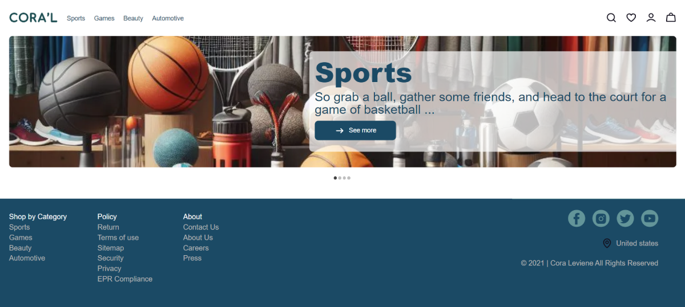

# Ecommerce Project

This is a personal educational project developed using Next.js based on a design from Figma. It is currently under development.

## Demo
You can view the demo output of this project [here](https://ecommerce-app-ngh.vercel.app/).

## Technologies Used
The following tools and technologies have been utilized in this project:
- Next.js
- Supabase
- SCSS modules
- react-slideshow-image

## Challenges
This project was created for further learning in frontend development, especially working with Next.js. The challenges I have faced so far include:
1. Establishing best practices in folder structure.
2. Understanding concepts like SSG and SSR (although these concepts are still ambiguous to me and remain challenging).
3. Making the project responsive.
4. Working with Supabase.
5. Deploying the project on Vercel.

As a beginner developer, I have encountered many challenges, but the most important ones are the above.
